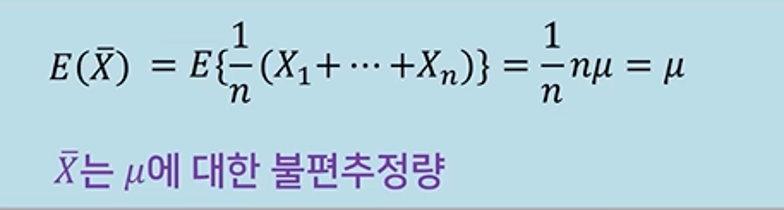
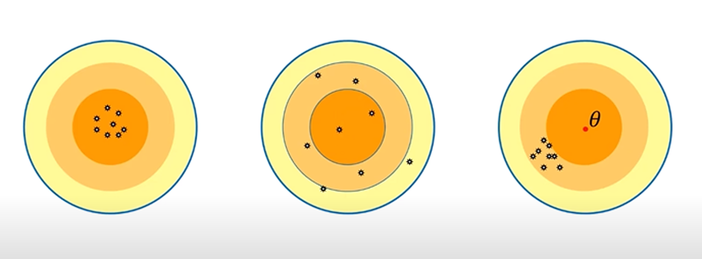
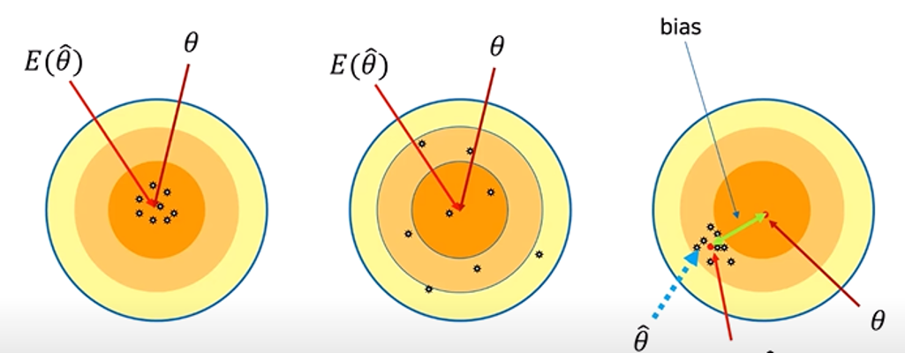
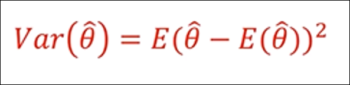
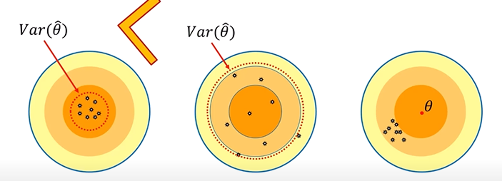
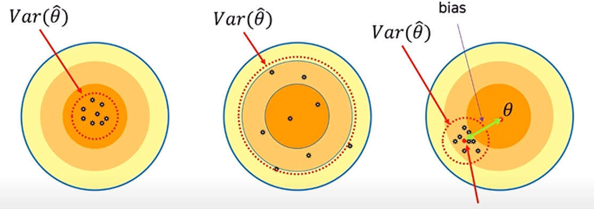
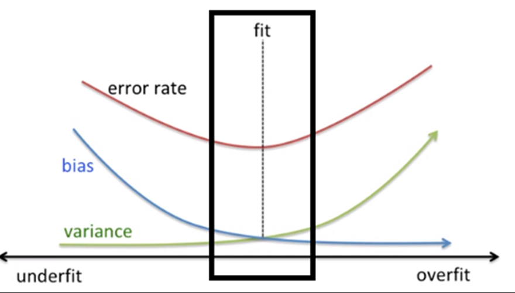
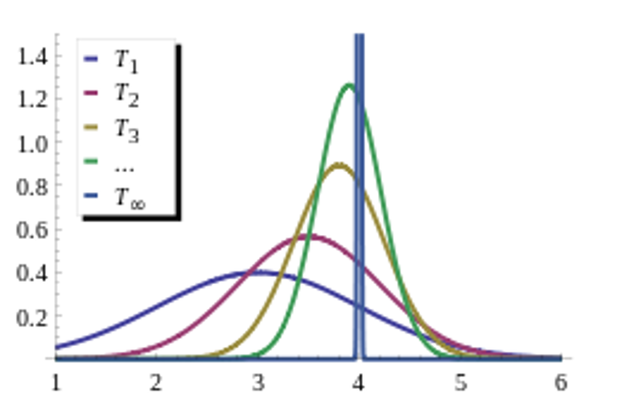

# 5.4 Estimators, Bias and Variance
## 모집단과 표본
### 모집단
- 정보를 얻고자 하는 대상집단 전체
- 모수 (parameter)를 얻는다.

### 표본
- 모집단을 대표할 수 있는 일부 집단
- 무작위추출 (random sampling)이 필요
- 통계량 (statistic)을 얻는다.

관심있는 대상 전체를 '모집단'이라고 하고, 모집단에서 random sampling한 것을 '표본'이라고 한다. 모집단의 평균을 보통 우리는 모수라고 하며 theta라고 읽는다.  표본에서의 평균은 추정값이라 하며 theta hat이라고 읽는다.

## 점추정
점추정이란 모수를 하나의 값으로 추정하는 것을 말한다. 예를 들자면 여론 조사나, 성인 남녀 키의 평균을 낼 때 등 사용한다.

  

위의 식은 표본에서 평균을 추출할 때 쓰는 식이다.

그렇다면 이번엔 간단한 표본추출을 해볼 것이다.

  

위의 주머니에서 우리는 랜덤으로 3개를 뽑아 평균을 구할 것이다. 그리고 3개의 질문에 답을 할 것이다.

Q1. 주머니 안의 평균이 얼마라고 추정하는가?

Q2. 모집단의 평균은 얼마인가?

Q3. 주머니 안의 평균이 모수와 동일한가?

A1. 주머니 안의 평균은 105라고 추정할 것이다. 왜냐하면 우리가 주머니 안에서 뽑은 수밖에 정보가 없기 때문이다. 이것을 점추정이라고 한다.

A2. 모집단의 평균은 즉, 주머니 안의 진짜 평균을 말한다. 답은 110으로 이것을 모수라고 한다.

A3. 주머니 안의 평균과 모수가 동일한가를 따져보면 당연히 답은 No이다. 이유는 표본오차가 존재하기 때문이다.

### 어떤 점추정량이 좋은가?
- 모수 θ를 점추정량 θ^으로 추정할 때, 모수는 하나이지만 점추정량은 여러 개일 수 있다.
- 여러 점추정량 중에 어떤 값이 가장 바람직하다고 할 수 있는가?
- 위의 질문에 대한 판단기준으로 보통 3가지가 있다.
	- 불편성
	- 최소분산
	- 최소MSE

### 1. 불편성(unbiasedness)
- 추정량의 기대값이 모수와 일치한다.
- 추정량의 기대값과 모수의 차이인 편의(bias)가 0이다.

#### 불편추정량은?

과녁으로 예를 들어보자. 한 가운데가 모수이고, 작은 점들은 추정값이라고 한다. 

첫 번째 과녁과 두 번째 과녁의 추정값 평균을 보면 모수와 일치하는 것을 볼 수 있다. 그러므로 불편추정량은 첫 번째 과녁과 두 번째 과녁이라고 할 수 있다. 세 번째 과녁은 추정값의 평균과 모수가 불일치하기 때문에 편향(bias)이 생겨 불편추정량이라고 할 수 없다.

### 2. 최소분산(minimum variance)
- 추정량의 편차가 적어야 한다.

#### 최소분산?

분산은 흩어진 정도를 나타낸다. 그러므로 첫 번째 과녁과 두 번째 과녁을 보면 당연히 첫 번째 과녁의 분산이 작은 것을 알 수 있다. 그리고 세 번째 과녁도 분산이 작다는 것을 볼 수 있지만 세 번째 과녁은 bias가 존재한다는 문제가 있다. 이 문제는 어떻게 해결할까?

### 3. 최소MSE(min mean squared error)
- 불편성과 분산을 동시에 고려
- MSE = var + bias²

#### 최소MSE?

최소분산에서의 문제를 해결할 수 있는 것이 최소MSE이다. 최소MSE는 불편성과 분산을 동시에 고려하기 때문에 어느 한 쪽이 커질 일을 방지할 수 있다. 그러므로 가장 좋은 것은 첫 번째 과녁임을 알 수 있다.

그래프를 보면 좀 더 쉽다. 왼쪽은 언더피팅, 오른쪽은 오버피팅이 발생하는 그래프이다. 결국 우리는 오류율이 가장 낮은 가운데 지점을 찾아야 한다. 그 가운데 지점을 찾기 위해서는 분산과 bias제곱의 합이 최소인 값을 구하면 된다.

### 일치성(Consistency)

위 그래프와 같이 표본의 크기(n)가 커감에 따라 T1에서 T2, T∞처럼 그래프가 변화하는 것이 보인다. 이처럼 표본의 크기가 커짐에 따라 표본의 통계량이 모집단의 모수와 일치하게 되는 것을 일치성이 증가한다고 한다. 참고로, 위 그래프의 통계량은 편향되었다. 이유는 T1의 평균인 3의 부근에 모이지 않고 다른 값에 모이기 때문이다. 그 말은 즉, 추정량의 기대값과 모수가 다르다는 것이다.

### Reference
- 

- 