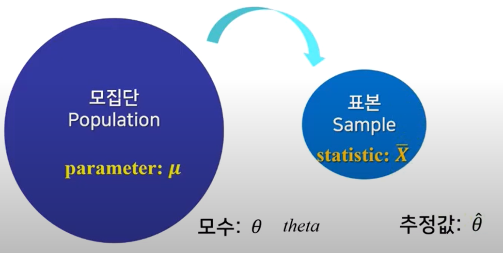
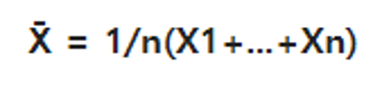
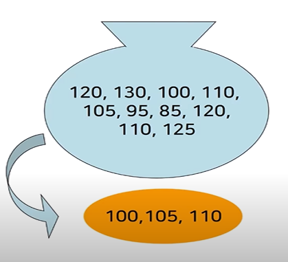

# 5.4 Estimators, Bias and Variance
## 모집단과 표본
### 모집단
- 정보를 얻고자 하는 대상집단 전체
- 모수 (parameter)를 얻는다.

### 표본
- 모집단을 대표할 수 있는 일부 집단
- 무작위추출 (random sampling)이 필요
- 통계량 (statistic)을 얻는다.

관심있는 대상 전체를 '모집단'이라고 하고, 모집단에서 random sampling한 것을 '표본'이라고 한다. 모집단의 평균을 보통 우리는 모수라고 하며 theta라고 읽는다.  표본에서의 평균은 추정값이라 하며 theta hat이라고 읽는다.

### 점추정
점추정이란 모수를 하나의 값으로 추정하는 것을 말한다. 예를 들자면 여론 조사나, 성인 남녀 키의 평균을 낼 때 등 사용한다.

  
위의 식은 표본에서 평균을 추출할 때 쓰는 식이다.

그렇다면 이번엔 간단한 표본추출을 해볼 것이다.

  
위의 주머니에서 우리는 랜덤으로 3개를 뽑아 평균을 구할 것이다. 그리고 3개의 질문에 답을 할 것이다.

Q1. 주머니 안의 평균이 얼마라고 추정하는가?

Q2. 모집단의 평균은 얼마인가?

Q3. 주머니 안의 평균이 모수와 동일한가?

A1. 주머니 안의 평균은 105라고 추정할 것이다. 왜냐하면 우리가 주머니 안에서 뽑은 수밖에 정보가 없기 때문이다. 이것을 점추정이라고 한다.

A2. 모집단의 평균은 즉, 주머니 안의 진짜 평균을 말한다. 답은 110으로 이것을 모수라고 한다.

A3. 주머니 안의 평균과 모수가 동일한가를 따져보면 당연히 답은 No이다. 이유는 표본오차가 존재하기 때문이다.

#### 어떤 점추정량이 좋은가?
- 모수 θ를 점추정량 θ^으로 추정할 때, 모수는 하나이지만 점추정량은 여러 개일 수 있다.
- 여러 점추정량 중에 어떤 값이 가장 바람직하다고 할 수 있는가?
- 위의 질문에 대한 판단기준으로 보통 3가지가 있다.
	- 불편성
	- 최소분산
	- 최소MSE

